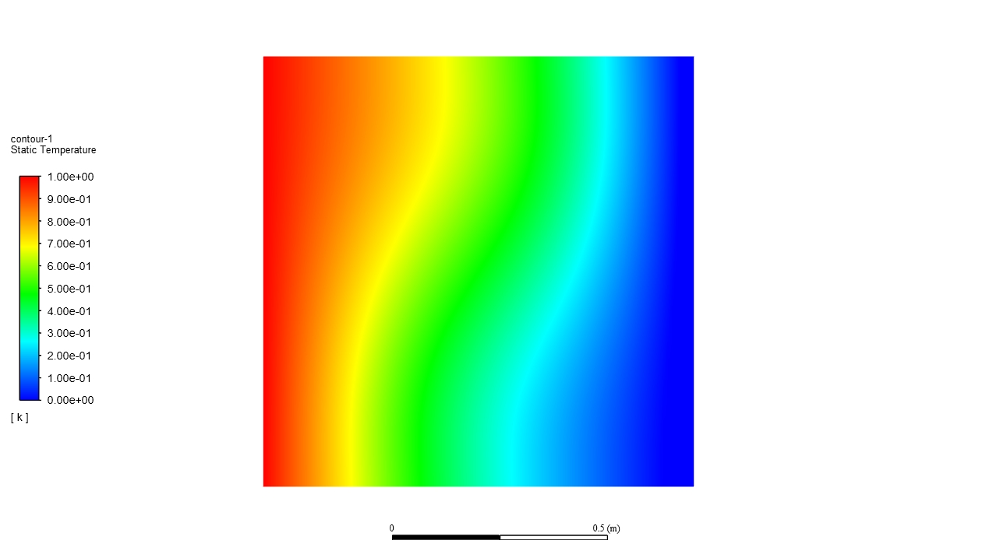
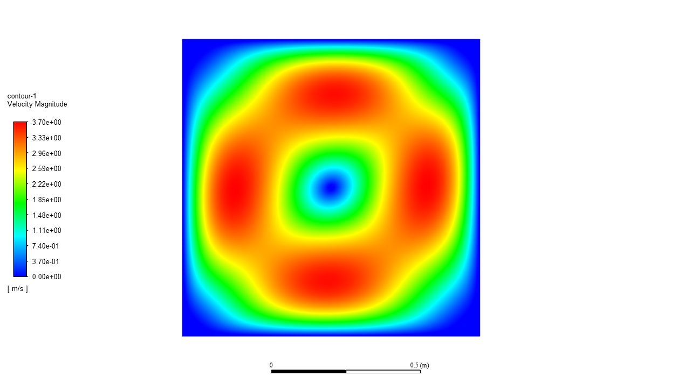
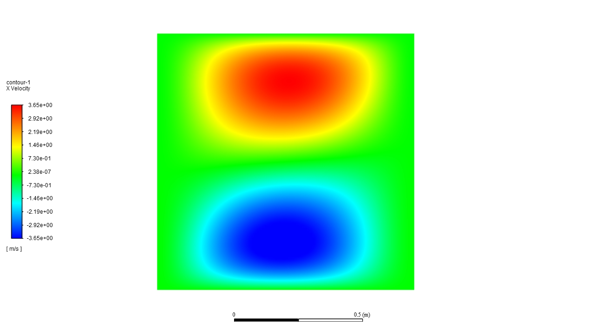
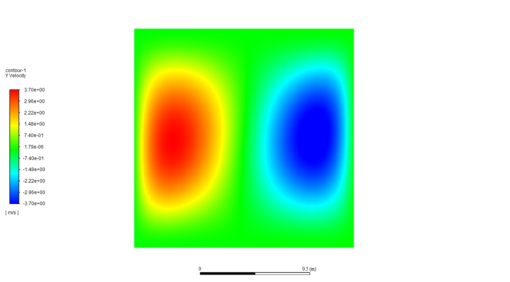
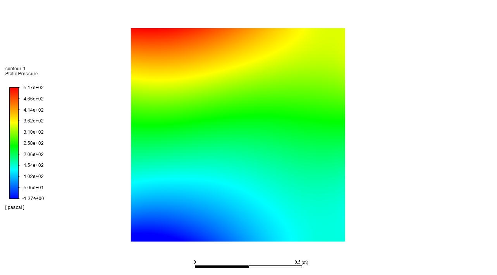

# 二维方腔自然对流的N种解法

## 1. 可计算建模
### 1.1 问题描述与数学物理模型

  

    计算域与边界条件

 
如图所示，二维方腔的上下边界均为均为绝热边界，左边界为高温边界，右边界为低温边界。
当高温边界与低温边界温度差别较小（<15℃）时，即

$$\Delta\rho \ll \rho$$

时，可以采取Boussinesq假设：假设密度变化对流场没有影响，在计算时只需考虑产生浮力的情况。由此可以得到简化后的N-S方程：

- 连续方程:

  $$\frac{\partial u}{\partial x} +  \frac{\partial v}{\partial y}=0 $$ 

- 动量方程:
  
  $x$方向: 

  $$ u\frac{\partial u}{\partial x} +  v\frac{\partial u}{\partial y}=-\frac{1}{\rho}\frac{\partial p}{\partial x}+ \nu(\frac{\partial^2 u}{\partial x^2} + \frac{\partial^2 u}{\partial y^2})$$ 

  $y$方向: 

  $$ u\frac{\partial v}{\partial x} +  v\frac{\partial v}{\partial y}=-\frac{1}{\rho}\frac{\partial p}{\partial y}+ \nu(\frac{\partial^2 v}{\partial x^2} + \frac{\partial^2 v}{\partial y^2}) + g\beta(T-T_0) $$

- 能量方程：
  
  $$ u\frac{\partial T}{\partial x} +  v\frac{\partial T}{\partial y}=a(\frac{\partial^2 T}{\partial x^2} + \frac{\partial^2 T}{\partial y^2}) $$

### 1.2 方程无量纲化

为了更加直观的理解**相似原理**，展示流动的相似性，下面通过**量纲分析**对以上方程进行无量纲化，进而求解无量纲方程。一组无量数下无量纲方程得到的结果代表了整个相似组的解。
采用以下形式对变量进行无量纲化：

$$x'=\frac{x}{l},\quad y'=\frac{y}{l}, \quad u'=\frac{ul}{a}, v'=\frac{vl}{a},\quad T'=\frac{T-T_c}{T_h-T_c}, \quad p'=\frac{pl^2}{\rho a^2}$$

其中， $l$ 为方腔边长， $a$ 为热扩散率， $T_h$ 和 $T_c$ 分别为方腔左边界与右边界的温度， $\rho$ 为方腔内流体密度。将以上无量纲量带入连续方程、动量方程和能量方程，并省略无量纲量的上标 $'$ ，可得二维方腔自然对流的无量纲方程组：

- 连续方程:

  $$ \frac{\partial u}{\partial x} +  \frac{\partial v}{\partial y}=0 $$

- 动量方程:

  $x$方向: 

  $$ u\frac{\partial u}{\partial x} +  v\frac{\partial u}{\partial y}=-\frac{\partial p}{\partial x}+ Pr(\frac{\partial^2 u}{\partial x^2} + \frac{\partial^2 u}{\partial y^2}) $$

  $y$方向: 

  $$ u\frac{\partial v}{\partial x} +  v\frac{\partial v}{\partial y}=-\frac{\partial p}{\partial y}+ Pr(\frac{\partial^2 v}{\partial x^2} + \frac{\partial^2 v}{\partial y^2}) + RaPrT$$

- 能量方程：
  
  $$ u\frac{\partial T}{\partial x} +  v\frac{\partial T}{\partial y}=\frac{\partial^2 T}{\partial x^2} + \frac{\partial^2 T}{\partial y^2} $$

- 边界条件：
  - 左边界： 
  
  $$u=v=0,\quad T=1, \quad \frac{\partial p}{\partial x}=Pr\frac{\partial^2 u}{\partial x^2},\quad x=0, \quad 0\leq y \leq 1,$$

  - 右边界： 
  
  $$u=v=0,\quad T=0, \quad \frac{\partial p}{\partial x}=Pr\frac{\partial^2 u}{\partial x^2},\quad x=1, \quad 0\leq y \leq 1,$$

  - 下边界： 
  
  $$u=v=0,\quad \frac{\partial T}{\partial y}=0, \quad \frac{\partial p}{\partial y}=Pr\frac{\partial^2 v}{\partial y^2} + PrRaT,\quad y=0, \quad 0\leq x \leq 1,$$

  - 上边界： 
  
  $$u=v=0,\quad \frac{\partial T}{\partial y}=0, \quad \frac{\partial p}{\partial y}=Pr\frac{\partial^2 v}{\partial y^2} + PrRaT,\quad y=1, \quad 0\leq x \leq 1,$$

其中 $Pr=0.7, Ra=1000$ ，对该无量纲方程组进行求解。

## 2. 算法
### 2.1 FVM商软求解
采用ANSYS Fluent商业软件对该问题进行求解，Fluent中求解的是有量纲方程，因此需要通过对Fluent中物性参数的设置，使得Fluent中的有量纲方程与上述无量纲方程(5)-(8)进行求解。

以下是Fluent计算结果：

- 温度场
  

  
  

- 速度场
  

  
  

  

  
  

  

  
  

  - 压力场
  

  
  

### 2.2 paddlesci求解（Python）

### 2.3 paddle求解（Python）

### 2.4 FEM求解（C++）

### 2.5 FVM求解（C++）

### 2.6 FEM求解（C++）

### 2.7 谱方法求解（C++）

### 2.8 LBM求解（C++）